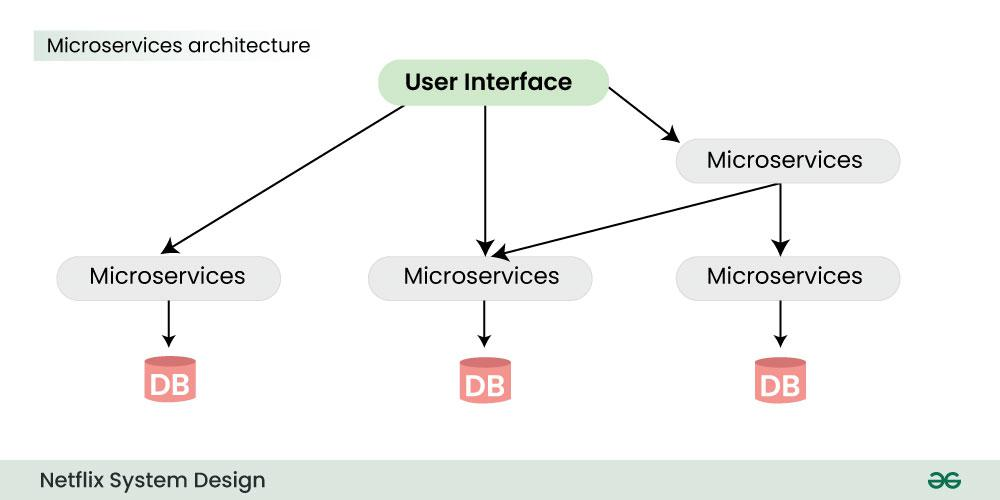
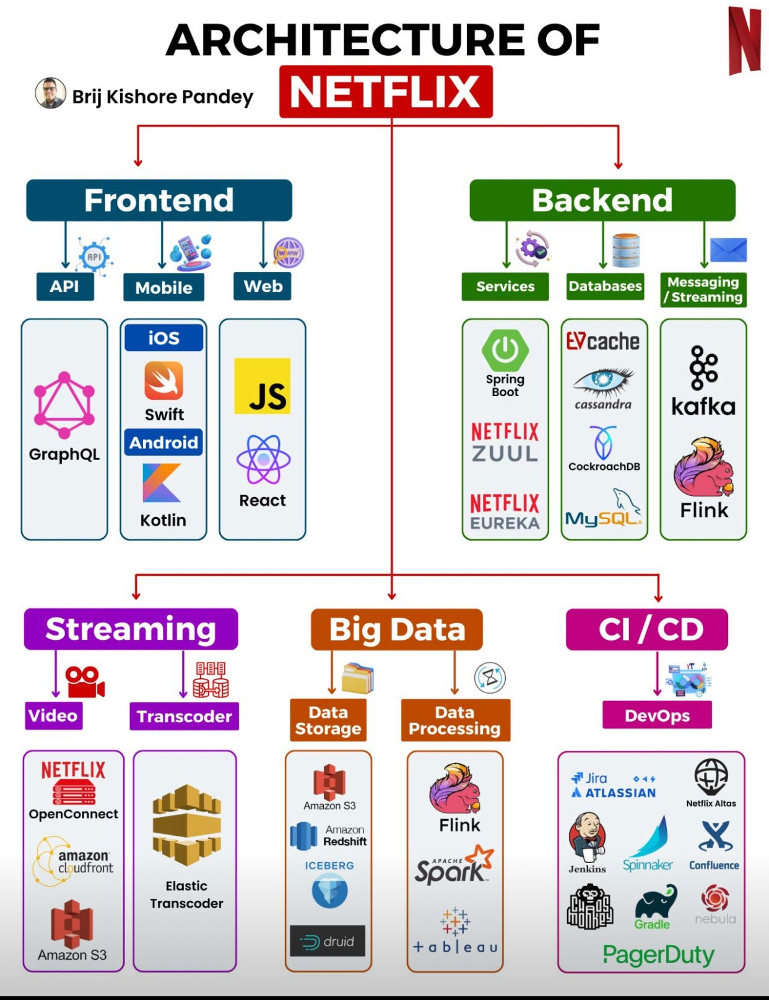

# Netflix Architecture
 - A escolha da Netflix como tema deste trabalho foi motivada pela sua infraestrutura tecnológica complexa e robusta, que serve como um excelente estudo de caso. A Netflix, líder global no mercado de streaming de vídeo, exemplifica como arquiteturas de software avançadas podem suportar escalabilidade massiva, alta disponibilidade e entrega eficiente de conteúdo a milhões de usuários simultâneos em todo o mundo. Além disso, a Netflix utiliza uma variedade de tecnologias e padrões arquiteturais inovadores, como microserviços, computação em nuvem e práticas de DevOps, tornando-a um modelo exemplar para a aplicação de princípios modernos de arquitetura de software em sistemas de larga escala. Estudar a Netflix proporciona uma oportunidade valiosa para entender como esses conceitos foram implementados para atender às exigências rigorosas de desempenho e confiabilidade.

## Caracterização do sistema
 - A caracterização do sistema da Netflix revela diversos dados importantes que influenciam nas decisões arquiteturais. Atuando no nicho de mercado de streaming de vídeo, a Netflix atende a uma base global de mais de 230 milhões de assinantes, com picos de acessos simultâneos que podem alcançar dezenas de milhões de usuários. Esta escala massiva exige uma arquitetura altamente escalável e resiliente. A segurança é um requisito crucial, considerando a necessidade de proteger vastos volumes de dados pessoais e transações financeiras dos usuários, bem como garantir a integridade e a privacidade do conteúdo distribuído. Além disso, a infraestrutura deve suportar uma entrega eficiente e de baixa latência de conteúdo de alta definição, o que implica no uso de tecnologias avançadas de cache, redes de entrega de conteúdo (CDNs) e otimização de tráfego. Estes fatores, juntamente com a necessidade de uma disponibilidade contínua e a capacidade de atualização frequente dos serviços sem interrupções, guiam as decisões arquiteturais da plataforma.

## Modelo arquitetural do sistema
- Para atender seus mais de 230 milhões de assinantes em mais de 200 países, a Netflix trabalha com dois sistemas clouds, AWS e Open Connect, que trabalham juntas para prover uma boa responsabilidade e streaming de alta qualidade a seus usuários

**Figura 1 - Modelo de Arquitetura em Alto Nível da Netflix (tirado de: https://www.geeksforgeeks.org/system-design-netflix-a-complete-architecture/)**

- A aplicação possui 3 componentes principais:
- Cliente:
    - Dispositivo (Interface do Usuário) que é usado para navegar e reproduzir vídeos da Netflix. TV, XBOX, laptop ou celular, etc.
- OC (Open Connect) ou Netflix CDN:
    - CDN é a rede de servidores distribuídos em diferentes localizações geográficas, e Open Connect é a própria CDN global personalizada da Netflix.
    - Ele lida com tudo o que envolve streaming de vídeo.
    - É distribuído em diferentes locais e uma vez que você clica no botão de reprodução, o fluxo de vídeo deste componente é exibido em seu dispositivo.
    - Então, se você está tentando reproduzir o vídeo sentado na América do Norte, o vídeo será servido do open connect (ou servidor) mais próximo em vez do servidor original (resposta mais rápida do servidor mais próximo).
- Backend (Database):
     - Esta parte lida com tudo o que não envolve streaming de vídeo, como fazer upload de novos conteúdos, processar vídeos, distribuí-los para servidores localizados em diferentes partes do mundo e gerenciar o tráfego de rede.
     - A maioria dos processos é cuidada pela Amazon Web Services.

## Arquitetura de microsserviços da Netflix
- A arquitetura da Netflix é construída por uma coleção de serviços, conhecida como arquitetura de microserviços e ela alimenta todas as APIs necessárias para suas aplicações e serviços Web. Quando a solicitação chega ao endpoint, ela chama outros microsserviços para obter os dados necessários e esses microsserviços também podem solicitar dados de diferentes microsserviços. Depois disso, uma resposta é enviada para a solicitação da API de volta ao endpoint.

**Figura 2 - Arquitetura de Microsserviços da Netflix (tirado de: https://www.geeksforgeeks.org/system-design-netflix-a-complete-architecture/)**

## Tecnologias Utilizadas

**Figura 3 - Tecnologias Usadas pelo Sistema (tirado de: https://saxenasanket.medium.com/system-design-of-netflix-part-1-4d65642ed738)**

A arquitetura da Netflix evoluiu ao longo do tempo para atender as necessidades cada vez maiores e mais complexas, conforme o mercado exigia. Ela é baseada no uso de microsserviços, cloud-native e implantação contínua.
	Os principais requisitos que levaram à evolução da arquitetura da Netflix e suas decisões de projeto foram escalabilidade, resiliência e a necessidade de um desenvolvimento ágil.
 
Para resolver a questão da escalabilidade, gerada por um volume considerável de tráfego com frequentes picos, ela faz o uso de micro serviços, de modo que serviços possam dividir as responsabilidades e funcionalidades da aplicação, escalando de forma independente relativo à demanda do mercado. Ainda para o problema da escalabilidade, a Netflix faz o uso de cloud computing (principalmente a AWS), para escalar recursos automaticamente de forma rápida e dinâmica para atender a demanda e as situações de pico, conhecido também como auto scaling.

Para ser altamente tolerante a falhas a Netflix utiliza de redundância para evitar falhas em uma única região, circuit breakers para isolar falhas de serviço e chaos engineering, que consiste em uma prática de introduzir intencionalmente falhas para gerar falhas e erros facilitando o encontro de vulnerabilidades.

Para o desenvolvimento ágil a Netflix usa a metodologia Scrum e o DevOps para agilizar o processo de desenvolvimento e implantação.
	Os principais componentes da arquitetura são API Gateway, microsserviços, sistema de descoberta de serviços, banco de dados (relacionais e não relacionais), sistema de armazenamento em cache, fila de mensagens e monitoramento de alertas.
 
É importante dar destaque ao sistema de descoberta de serviços e a forma de armazenamento em cache que a netflix implementa. Falando inicialmente sobre a descoberta de serviços, a própria Netflix desenvolveu um sistema chamado Eureka, de código aberto. Esse serviço atua como um repositório centralizado onde serviços se registram e atualizam seus status, isso traz vantagens como melhor escalabilidade, por proporcionar a saída e entrada de novos serviços de forma dinâmica e sem afetar o sistema, e maior tolerância a erros de forma a evitar falhas em cascata.

O mecanismo de cache implementado pela Netflix se destaca pela forma que consegue ajudar na velocidade, escalabilidade e baixa latência. Isso é possível devido ao uso de cache em memória, cache distribuído e cache em CDN. A Netflix usa o Memcached, um sistema de cache distribuído de código aberto que armazena dados em memória, altamente escalável e de alto desempenho.
	A Netflix em constante evolução, altera as tecnologias usadas com frequência, atualmente as tecnologias que é possível ter ciência do uso são:
	
	
### Linguagens de programação: 
Java: Linguagem principal para a maioria dos serviços backend
Python: Usada para scripts, automação e análise de dados
Node.js: Usada para alguns serviços e interfaces de usuário
Go: Utilizada em alguns serviços de alta performance 

### Frameworks e Bibliotecas:
Spring Boot: Framework Java para desenvolvimento de microsserviços
Hystrix: Biblioteca para implementação de circuit breakers e resiliência
Eureka: Sistema de descoberta de serviços desenvolvido pela Netflix
RxJava: Biblioteca para programação reativa
React: Biblioteca JavaScript para desenvolvimento de interfaces de usuário

### Infraestrutura em Nuvem (AWS):
- EC2: Instâncias de computação virtual
- S3: Armazenamento de objetos
- DynamoDB: Banco de dados NoSQL
- RDS: Banco de dados relacional
- Elasticsearch: Mecanismo de busca
- Kinesis: Streaming de dados em tempo real
   ### Ferramentas de DevOps:
- Jenkins: Automação de build e implantação
- Spinnaker: Plataforma de implantação contínua
- Chaos Monkey: Ferramenta para testes de resiliência
- Atlas: Plataforma de monitoramento e telemetria
	### Outras Tecnologias:
- Cassandra: Banco de dados NoSQL de alta performance
- Kafka: Plataforma de streaming de mensagens
- Docker: Conteinerização de aplicações
- Kubernetes: Orquestração de containers
- Hadoop: Framework para processamento de grandes volumes de dados
- Spark: Framework para processamento de dados em tempo real
	### Tecnologias Proprietárias:
- Zuul: API Gateway
- Ribbon: Balanceador de carga
- Archaius: Gerenciamento de configurações
- Simian Army: Conjunto de ferramentas para testes de resiliência

