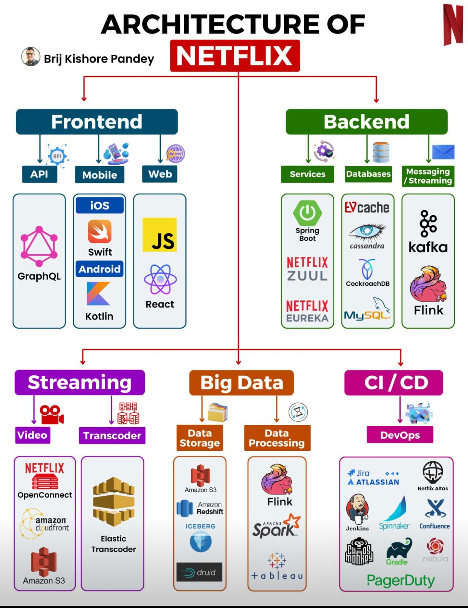

# Netflix Architecture
 - Por que a Netflix foi a plataforma escolhida pelo grupo?

## Caracterização do sistema
 - Inserir dados importantes que podem influenciar nas decisões arquiteturais, como por exemplo, nicho de mercado, número de clientes, número de acessos simultâneos, requisitos de segurança

## Modelo arquitetural do sistema

**Figura 1 - Modelo de Arquitetura da Netflix (tirado de: https://saxenasanket.medium.com/system-design-of-netflix-part-1-4d65642ed738)**
